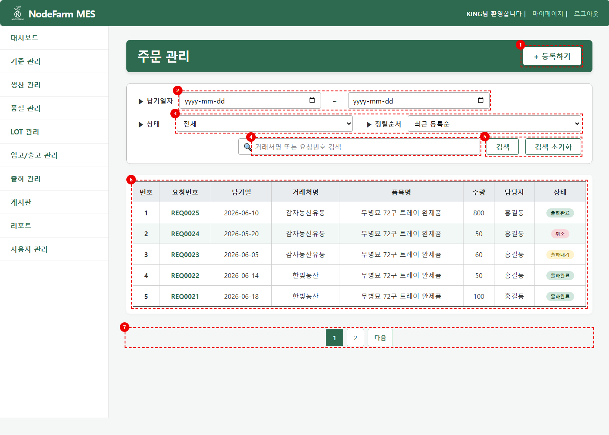
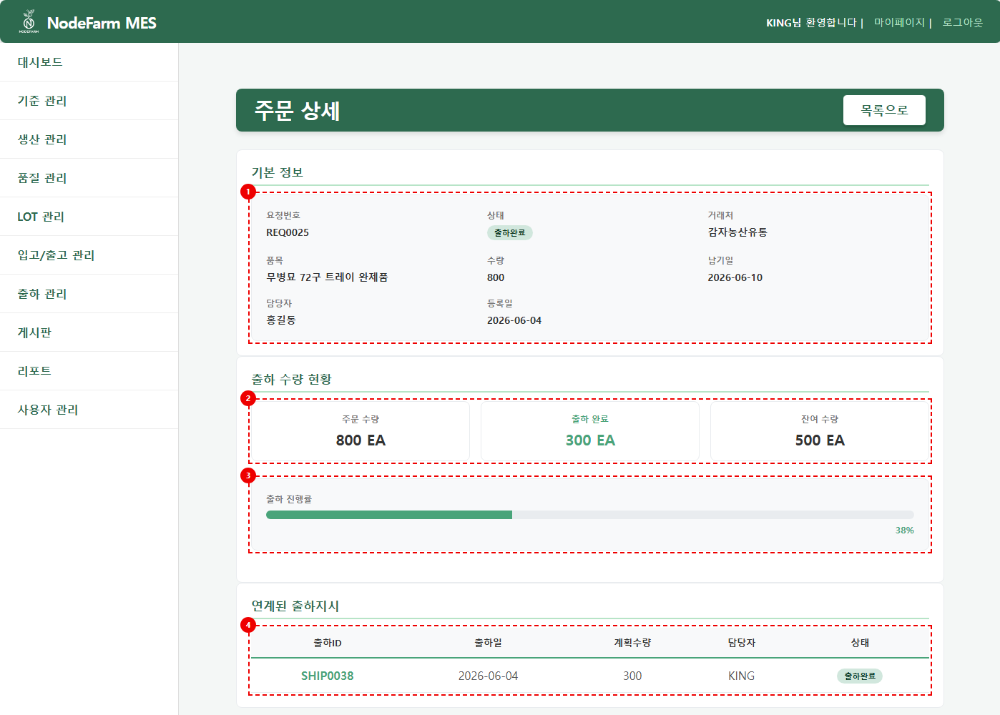
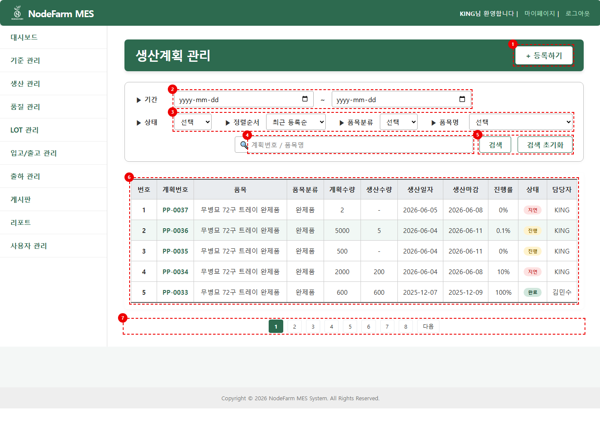
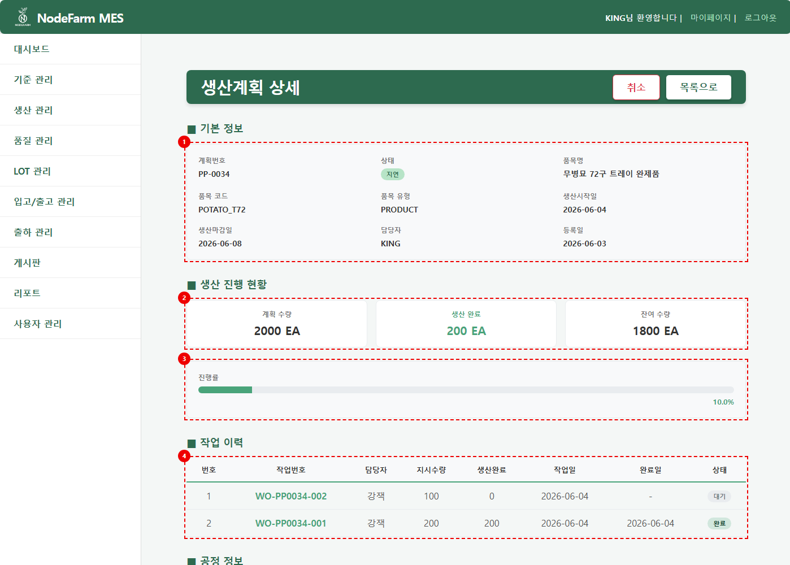
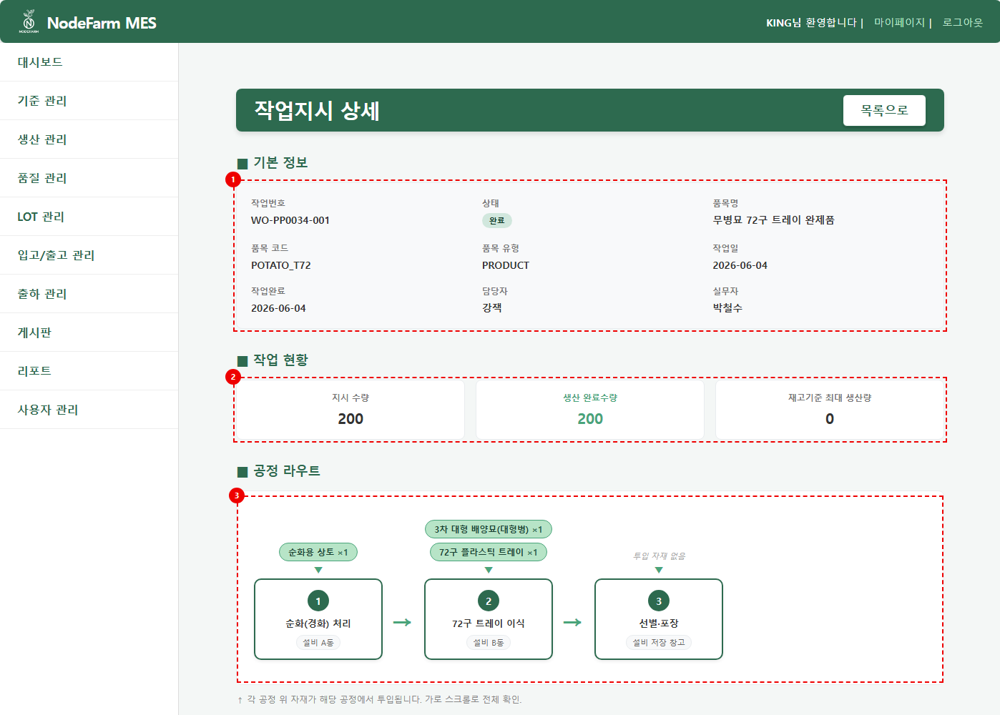
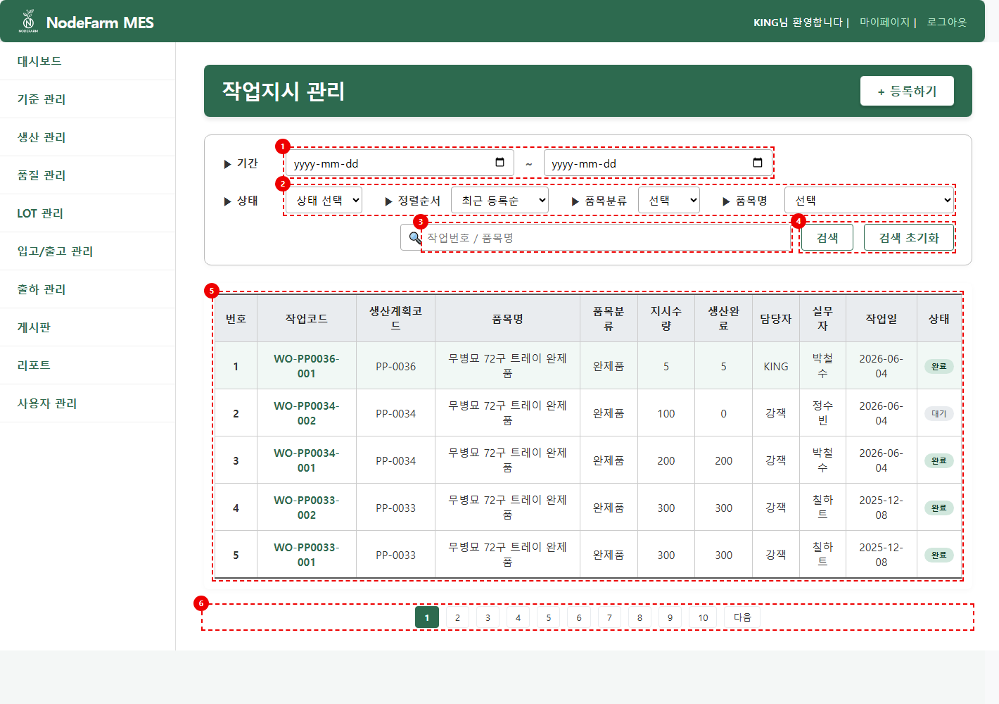
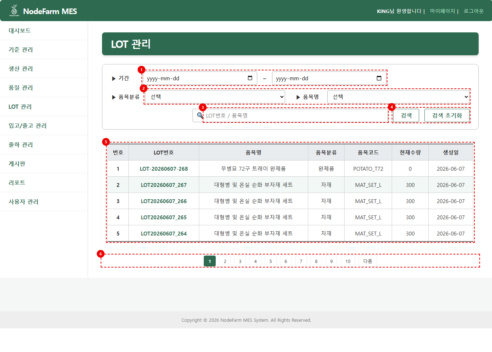
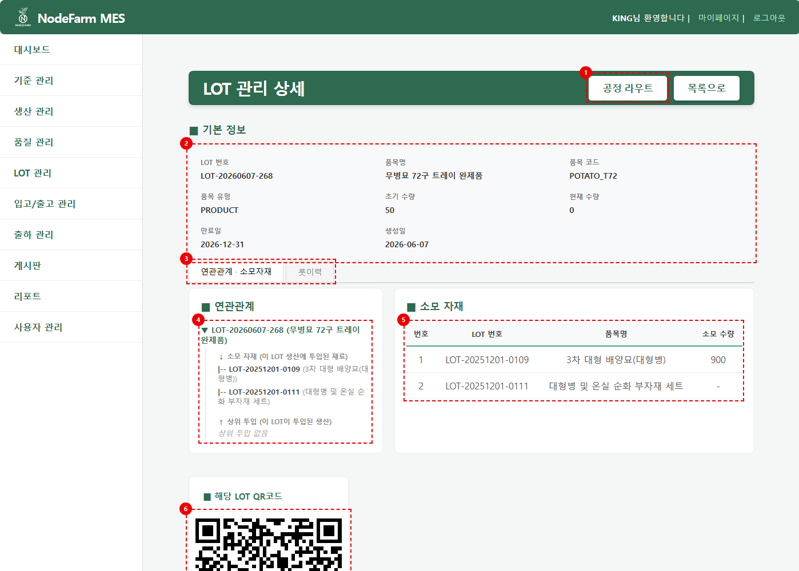
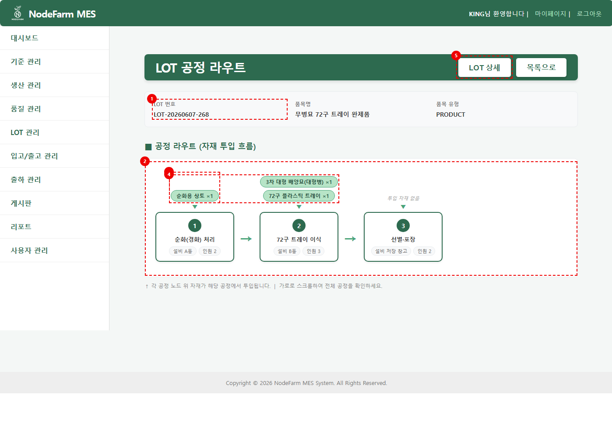
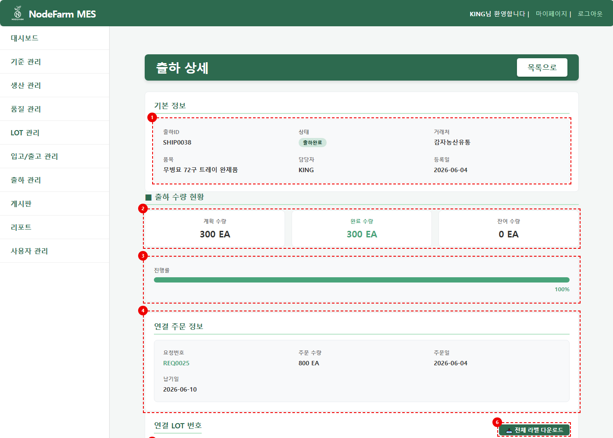

# 🌱 SmartFarm MES — 무병묘 생산·LOT 추적

> 이왕재 · Backend / Full-stack · 3차 팀 프로젝트

[노션 포트폴리오 · 발표자료](https://app.notion.com/p/3d8b0908229881388e04f66176c58406) · [팀 원본 저장소](https://github.com/songjonghan96-max/SmartFarm)

무병묘 스마트팜의 생산 전 과정을 하나의 웹 시스템에서 관리하는 지능화된 생산관리 솔루션(MES)입니다.
주문 접수부터 생산계획 수립, 작업지시, 공정 진행, LOT 추적, 출하까지 제조 실행의 흐름 전체를 Spring MVC + MyBatis 기반으로 구현했습니다.

## 📌 프로젝트 정보

- **기간** : 2026.05.12 ~ 2026.06.09 
- **팀** : 가시돋친개발자들 · 5명 — 최찬솔(팀장), 정현수, 송종한, 김지윤, 이왕재
- **담당 역할** : 주문관리 / 생산계획 / 작업지시 / LOT관리 / 출하관리 풀스택 구현

## 핵심 기여

- **공정별 상태머신**: 자재 투입·생산·LOT 생성을 묶어 처리하던 구조를 공정 순서와 상태를 검사하는 구조로 전환했습니다.
- **회차별 누적 생산**: 지시수량 일부를 생산한 뒤 다음 회차를 이어갈 수 있도록 `cycle_no`를 도입하고, 공정 이력은 보존하면서 완제품 LOT 수량은 누적했습니다.
- **추적성과 출하**: LOT 계보·공정 이력을 연결하고, 출하 시 수동 LOT 선택·분할·라벨 발급을 구현했습니다.

개발 기간은 개인 발표자료 기준이며, 6월 7~8일 공정 라우팅·반복 생산 개선을 포함합니다. 이 저장소는 팀 프로젝트의 개인 포트폴리오 정리본입니다.

## 🛠 기술 스택

- **Frontend** : HTML5, CSS3, JavaScript (Fetch API 기반 AJAX), JSP/JSTL, Apache Tiles
- **Backend** : Java, Spring MVC, MyBatis, REST API
- **Database** : Oracle
- **Server** : Apache Tomcat
- **Test** : JUnit 4, Mockito (BDD given-when-then 스타일)

## ✨ 전체 기능

| 모듈 | 설명 |
|---|---|
| 인증 / 권한 | 로그인, 비밀번호 변경, 사용자·권한 관리 |
| 대시보드 | 주요 생산 현황 지표 요약 |
| 게시판 | 공지 작성·조회·수정·삭제, 댓글, 파일 첨부 |
| 주문관리 | 출하요청 접수·검색·취소, 거래처 연동 |
| 생산계획 | 계획 수립·취소, 상태 자동 동기화 |
| 작업지시 | 공정별 상태머신 기반 생산 진행, 자재 투입, 회차(반복) 생산 |
| LOT관리 | 자재↔완제품 LOT 계보 추적, LOT 통합 이력, 공정 라우트 |
| 입출고 / 재고 | 입출고 이력 관리, 재고 현황 조회 |
| 품질관리 | 품질 검사, 불량 유형·불량품 관리 |
| 설비관리 | 설비 현황 조회, 설비 가동 로그 |
| 출하관리 | 출하 지시·확정·취소, LOT 분할 출하 |
| 리포트 | 생산 실적·불량 리포트 |
| 기준정보 | BOM, 품목, 공정, 거래처 마스터 데이터 관리 |

데이터베이스는 품목·LOT·공정·작업지시·출하 등 총 29개 테이블로 설계했습니다.

## 🙋 담당 기능 상세

3차 발표자료에서 추출한 실제 구현 화면입니다. 빨간 번호와 점선은 발표 당시의 기능 설명 표시입니다. 이미지를 클릭하면 원본 크기로 확인할 수 있습니다.

### 주문관리

| 주문 목록 — 납기·상태 검색 | 주문 상세 — 출하 진행률과 연결 지시 |
|---|---|
|  |  |

- 고객 출하요청의 접수·조회·취소를 구현했습니다. 상태는 `접수 → 출하대기 → 출하완료`로 흐르며 출하관리와 연동됩니다.
- 상태·품목유형·거래처·납기일·키워드 다중 조건 검색을 AJAX 비동기 조회로 구현해 새로고침 없이 필터링됩니다.
- 거래처 검색을 비동기 조회로 제공해 등록 화면에서 거래처를 바로 찾아 선택할 수 있습니다.
- 하나의 요청에 여러 건의 출하가 연결될 수 있어, 요청 수량 대비 출하 수량을 집계해 부분/전체 이행 여부를 추적합니다.
- 취소는 관리자 권한 이상 또는 담당자 본인만 가능하도록 세션 기반 접근 제어를 적용했습니다.

### 생산계획

| 생산계획 목록 — 기간·품목·상태 필터 | 생산계획 상세 — 수량·진행률·작업 이력 |
|---|---|
|  |  |

- 생산계획 수립·조회·취소를 구현하고, 계획 번호는 `PP-0001` 형식으로 자동 채번됩니다.
- 기간·상태·품목·시설·키워드 다중 필터와 페이징을 구현했습니다.
- 계획 상태를 자동 동기화합니다 — 시작일이 도래하면 `대기 → 진행`, 하위 작업지시의 생산량 합계가 계획 수량에 도달하면 자동으로 `완료` 처리됩니다.
- 계획 상세에서 연결된 작업지시 이력을 AJAX 페이징으로 조회할 수 있습니다.
- 등록은 관리자 이상, 취소는 상위 권한자 또는 작성자 본인만 가능하도록 권한을 분리했습니다.

### 작업지시



<details>
<summary>작업지시 목록 화면 보기</summary>



</details>

- 생산 진행을 **공정별 상태머신**으로 관리합니다. 작업지시를 시작하면 품목의 공정 라우팅대로 공정 기록이 생성되고, 각 공정이 `대기 → 자재투입 → 진행 → 완료`로 전이됩니다.
- 작업 시작 시 **완제품 LOT을 자동 생성**하고(유효기간 자동 부여), 생산이 진행될 때마다 수량을 누적합니다.
- **BOM 기반 자재 투입**: QC 합격 자재 LOT을 FIFO로 차감하고, 투입 내역·출고 이력을 기록하고 재고를 차감합니다. 투입 전에는 어떤 LOT에서 얼마나 차감될지 DB 변경 없이 미리보기로 확인할 수 있습니다.
- **최대생산량 계산**: 자재별 `가용재고 ÷ 소요량`의 최솟값을 구하고 지시 잔량으로 cap하여, 투입 수량 검증과 자재별 부족 안내에 사용합니다.
- **회차(Cycle) 반복 생산**: 한 작업지시에서 공정 라우팅을 여러 번 돌릴 수 있습니다. 회차마다 새 공정 기록을 생성해(`cycle_no`) 이전 회차의 이력을 보존하고, 완제품 LOT에는 회차별 생산량이 누적됩니다.
- 마지막 공정 완료 시 완제품 입고 처리, 재고 증가, 자재↔완제품 LOT 계보 기록, 생산계획 자동 완료까지 연쇄 처리합니다.

### LOT관리

| LOT 목록 — 검색과 현재수량 | LOT 상세 — 계보·소모자재·QR 코드 |
|---|---|
|  |  |



- 자재 투입과 생산 완료 시점에 **자재 LOT ↔ 완제품 LOT 계보**(`lot_relation`)를 기록하고, Oracle 계층형 쿼리(`CONNECT BY`)로 다단계 역추적을 구현했습니다 — 완제품 LOT 하나로 투입된 모든 자재 LOT을 거슬러 올라갈 수 있습니다.
- 계보 기록은 멱등 처리(`NOT EXISTS`)하여 회차 반복 생산 시에도 추적 트리가 중복으로 부풀지 않습니다.
- **LOT 통합 이력 타임라인**: 입출고 → 생산(회차×공정 단계) → 출하를 하나의 시간순 흐름으로 조회합니다. 분할된 LOT은 원본 LOT의 이력까지 이어서 보여줍니다.
- 품목별 **공정 라우트 흐름도**를 제공해 공정 순서와 공정별 투입 자재를 한 화면에서 확인할 수 있습니다.

### 출하관리

| 출하 목록 — 기간·품목·상태 검색 | 출하 상세 — 연결 주문·LOT·라벨 |
|---|---|
|  |  |

- 출하는 `지시(출하대기) → LOT 선택·확정(출하완료)`로 진행되며, 확정 시 요청 상태까지 함께 갱신됩니다.
- **출하 확정 트랜잭션**: 선택 수량이 LOT 잔량보다 적으면 자식 LOT을 분할 생성(`lot_split`)하고, LOT 차감·재고 차감·출하 이력 기록을 원자적으로 처리합니다. 중간에 하나라도 실패하면 전체 롤백됩니다.
- **재고 음수 방지**: `현재수량 ≥ 차감수량` 조건부 UPDATE와 영향 행 수 검증으로 차감 가능 여부를 검사하고, 갱신 실패 시 예외로 처리합니다.
- **중복 확정 방지**: 상태 조건부 UPDATE(claim-first)로 같은 출하 건을 두 번 확정하거나 확정된 건을 취소하는 경쟁 상황을 차단했습니다.
- 출하 가능 LOT은 완제품·QC 합격·유효기간 내·미할당 조건을 만족하는 LOT만 FIFO로 제시하고, 확정 수량 합계가 계획 수량을 초과하면 차단합니다.

## 🧪 테스트

저장소의 테스트 소스에서 `@Test` **62개**를 확인할 수 있습니다. 서비스 테스트는 Mockito 기반이며, 매퍼 파싱·SQL 구조 검사도 포함합니다. 아래 개수는 소스 기준으로, 이번 README 수정 중 62개 전체를 새로 실행한 결과는 아닙니다.

[회차 생산 구현 보고서](docs/cycle-production-report.md)에는 당시 단위·BDD **27개 PASS**(공정 17 + 회차 10), 실제 Oracle 트랜잭션 기반 E2E **16개 PASS**가 기록되어 있습니다. 보고서의 E2E는 데이터 계층 검증이며 브라우저 UI E2E는 미수행입니다.

| 테스트 | 검증 대상 | 개수 |
|---|---|---|
| [WorkProcessServiceTest](src/test/java/kr/or/smartfarm/work/WorkProcessServiceTest.java) | 작업지시 공정별 상태머신 | 17 |
| [WorkCycleServiceTest](src/test/java/kr/or/smartfarm/work/WorkCycleServiceTest.java) | 회차 반복 생산 | 10 |
| [ShipmentConfirmManualTest](src/test/java/kr/or/smartfarm/shipment/ShipmentConfirmManualTest.java) | 출하 확정·LOT 분할 | 12 |
| [ShipmentServiceImplTest](src/test/java/kr/or/smartfarm/shipment/ShipmentServiceImplTest.java) | 출하 서비스 | 9 |
| [ShipmentMapperParseTest](src/test/java/kr/or/smartfarm/shipment/ShipmentMapperParseTest.java) | 출하 매퍼 | 7 |
| [LotServiceImplTest](src/test/java/kr/or/smartfarm/lot/LotServiceImplTest.java) / [LotHistoryBddTest](src/test/java/kr/or/smartfarm/lot/LotHistoryBddTest.java) | LOT 서비스·이력 | 7 |

```java
@Test
public void 공정기록이_이미_있으면_생성하지_않는다() {
    given(dao.getSelectOne("WO")).willReturn(work("WO", "대기", 10, 9002, 100, 0, 0, null));
    given(dao.countWorkProcesses(10)).willReturn(3);

    service.ensureWorkProcesses("WO");

    verify(dao, never()).insertWorkProcess(anyMap());
}
```

## 🔥 트러블슈팅

### 단일 생산 처리에서 공정별 실행으로 전환

- **문제**: 단일 생산 처리 구조에서는 여러 공정의 순서, 자재 투입 시점, 완제품 LOT 생성 시점이 명확하지 않았습니다.
- **해결**: `work_process` 기반의 공정별 상태머신으로 전환했습니다. `ensureWorkProcesses`로 공정 기록을 준비하고, 자재투입·시작·완료 요청에서 현재 활성 공정과 상태를 검사합니다. 작업시작 때 완제품 LOT을 선생성하고 최종 공정 완료 시 생산입고와 계보를 연결합니다.
- **결과**: 공정별 진행 상태·시각·투입 자재를 추적할 수 있게 되었습니다.
- **근거**: [4d76ffe — 공정별 라우팅 상태머신](https://github.com/reactor02/portfolio-smartfarm/commit/4d76ffeabc9cc19af8d58080965a7936ff4e88cf)

### 반복 생산이 표현되지 않는 상태머신 설계 구멍

- **문제** : 공정별 상태머신 설계가 작업지시당 공정 기록을 1세트만 갖는 구조여서, 부분 생산(지시 100 중 40만 생산) 후 나머지를 이어서 생산할 방법이 없었습니다. 공정 상태를 억지로 리셋하면 완제품 수량이 누적되지 않고 덮어써지고, LOT 계보가 중복 기록되고, 몇 회차 생산인지 구분할 수 없어 추적이 깨졌습니다.
- **해결** : 기존 기록을 리셋하는 대신 **회차 번호(`cycle_no`)를 추가하고 회차마다 새 공정 기록 세트를 INSERT**하는 구조로 변경했습니다. 완제품 LOT은 누적 갱신, 계보 기록은 멱등 처리로 중복을 방지하고, 기존 데이터는 기본값 1회차로 처리해 하위 호환을 유지했습니다. 변경 후 기존 테스트 17개가 모두 통과해 회귀가 없음을 확인했습니다.
- **배운 점** : 이력 데이터는 수정·리셋하지 않고 행을 추가하는 방식으로 보존해야 추적성이 유지된다는 것, 그리고 상태머신을 설계할 때 "한 번만 돈다"는 암묵적 가정을 의심해야 한다는 것을 배웠습니다.

### 소모자재 조회 수량의 기준량 오류

- **문제**: LOT 소모자재 조회에서 `required_qty × init_qty`로 계산해 기준 생산량 대비 자재 투입 비율을 반영하지 못했습니다.
- **해결**: `BomDTO.child_qty`를 추가하고 `lot.xml`의 조회 계산 두 곳을 `child_qty × init_qty ÷ required_qty`로 변경했습니다.
- **예시**: 기준 생산량 100개에 자재 20개가 필요하면 40개 생산의 자재 소요량은 8개입니다.
- **범위**: 이 변경은 DTO와 LOT 소모자재 **조회 SQL**에서 확인됩니다. 작업지시의 실제 차감 로직 전체가 같은 공식으로 수정되었다는 뜻은 아닙니다.
- **근거**: [de23202 — 소모자재 수량 계산 수정](https://github.com/reactor02/portfolio-smartfarm/commit/de232023257882f2dee8e7ae7ed241f70d25b068)

## 협업과 회고

### 구현 방향의 차이를 합의로 해결

같은 주제에 대한 서로 다른 구현 경험으로 팀 내 방향성 차이가 발생했습니다. 선택지를 제시하고 각 안의 장단점 차이를 설명해 합의를 이끌었습니다. 담당 모듈은 생산계획·작업지시·LOT 관리였으며, 주문·출하 기능까지 연결했습니다. 이 협업 경험은 개인 3차 발표자료의 회고에 정리되어 있습니다.

### 구현 속도보다 변경 비용을 함께 고려

초기에는 테스트 없이 기능 동작을 우선해, 완성 후에도 버그 수정에 시간을 썼습니다. 완료한 기능을 계속 수정하면서 다른 기능 개발 시간이 줄어든 점도 회고했습니다. 개선 방향으로 테스트 우선 작성과 검증된 기능의 변경 범위 제한을 정리했고, 후반 공정·회차 생산 개선에는 회귀 테스트를 추가했습니다. 프로젝트 전체를 처음부터 TDD로 진행했거나 개발 시간이 정량적으로 단축되었다고 주장하지 않습니다.

## 커밋으로 보는 개선 과정

| 일자 | 변경 | 근거 |
|---|---|---|
| 2026.06.01 | 날짜 필수값 3단계 검증, 생산계획 완료 동기화, 라벨 PDF 다운로드, 화면 스크립트 분리 | [bc21efe](https://github.com/reactor02/portfolio-smartfarm/commit/bc21efef68c785a467a22bcef19378e2a63dcb0b) |
| 2026.06.01 | 소모자재 조회 수량을 BOM 비율식으로 수정 | [de23202](https://github.com/reactor02/portfolio-smartfarm/commit/de232023257882f2dee8e7ae7ed241f70d25b068) |
| 2026.06.06 | LOT 라우트 및 작업지시 공정 추적 추가 | [ac95bcd](https://github.com/reactor02/portfolio-smartfarm/commit/ac95bcdadb7fede390941b7ebe921279d81fd506) |
| 2026.06.07 | 작업지시를 공정별 순차 상태머신으로 전환 | [4d76ffe](https://github.com/reactor02/portfolio-smartfarm/commit/4d76ffeabc9cc19af8d58080965a7936ff4e88cf) |
| 2026.06.07 | 출하 LOT 선택의 부족·충족·초과 안내, 숫자 변환 및 화면 이벤트 정리 | [74515e8](https://github.com/reactor02/portfolio-smartfarm/commit/74515e8cdfff11c69e4aa24fc60774d6a32e7069) |
| 2026.06.08 (KST) | 회차 반복 생산, 현재 회차 격리, 완제품 수량 누적, LOT 계보 중복 삽입 방지 | [4f264c9](https://github.com/reactor02/portfolio-smartfarm/commit/4f264c96b37921a6c3ef3e98195b0c06b141299c) |
| 2026.06.08 | .gitignore 경로 규칙 수정으로 누락된 DTO·테스트 추적 | [e444009](https://github.com/reactor02/portfolio-smartfarm/commit/e4440093ffd32ac08ecb204bfed8376a802389db) |

## 주요 소스

- [작업지시 서비스](src/main/java/kr/or/smartfarm/work/WorkServiceImpl.java)
- [작업지시 매퍼](src/main/resources/mybatis/mappers/order.xml)
- [LOT 조회·계보 매퍼](src/main/resources/mybatis/mappers/lot.xml)
- [출하 서비스](src/main/java/kr/or/smartfarm/shipment/ShipmentServiceImpl.java)
- [회차 스키마 변경](db/alter_work_process_cycle.sql)
- [회차 생산 구현·검증 보고서](docs/cycle-production-report.md)

## 💡 배운 점

- 자재 투입 하나에 LOT 차감·재고 차감·이력 기록이 얽히는 것을 경험하며, 여러 테이블을 함께 변경하는 로직은 트랜잭션 원자성과 실패 시 롤백을 기본으로 설계해야 한다는 것을 익혔습니다.
- 같은 요청이 두 번 와도 안전해야 한다는 멱등성 관점(조건부 UPDATE, NOT EXISTS 삽입)을 실제 동시성 문제를 다루며 체득했습니다.
- MES의 핵심은 추적성이라는 것을 LOT 계보·이력 기능을 구현하며 이해했습니다 — 데이터를 "지금 상태"가 아니라 "어떻게 여기까지 왔는지"로 설계하는 관점을 갖게 되었습니다.
 

